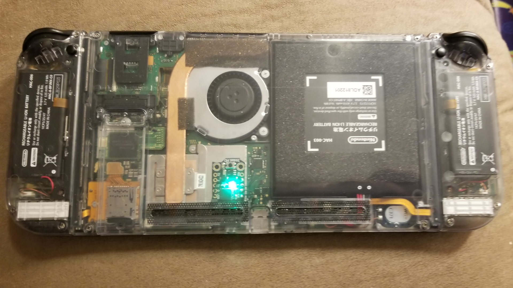

# sam-fusee-launcher-internal

Fusee Launcher for the adafruit trinket m0 board. Based on [sam fusee launcher](https://github.com/atlas44/sam-fusee-launcher) by atlas44 and the [fork by noemu](https://github.com/noemu/sam-fusee-launcher).

Build and tested with Arduino SDK.

I created this fork to create an **internal** Trinket M0 mod. This chip will
pull down the `RCM_STRAP` when the switch turns on, and then once it detects
RCM mode it will upload a payload and go to sleep. If it cannot find RCM mode
it will also simply go to sleep.

If you expose a reset wire outside the switch or put a magnetic or physical
button on the switch you can put the trinket into bootloader mode and flash a
new payload without opening it again. It's pretty hacky but it kind of works.

Once an open source chainloader payload is released, reflashing the trinket
shouldn't be necessary anymore.

**This installation is NOT for the faint of heart. It requires soldering to one
end of an extremely small capacitor.**

**Additionally, this is all experimental, there are some issues (see below).**

**This code and these instructions are distributed with no warranty or support.
You are responsible for your own actions. Only perform this if you have the
skills and equipment to do so.**

# Software Installation

Go through [trinket m0: arduino-ide-setup](https://learn.adafruit.com/adafruit-trinket-m0-circuitpython-arduino/arduino-ide-setup) and [trinket m0: arduino-ide-setup2](https://learn.adafruit.com/adafruit-trinket-m0-circuitpython-arduino/using-with-arduino-ide) and read very carefully.

Summary:
* Download and install arduino IDE http://www.arduino.cc/en/Main/Software
* In Arduino: go to "Prefences" and add to "Additional Board Manager URLs" followin URL:
*  `https://adafruit.github.io/arduino-board-index/package_adafruit_index.json`
* go to "Tools > Board > Board Manager" and select Type: All and
* Install "Arduino - Boards SAMD"
* Install "Adafruit SAMD Boards" by Adafruit
* Select the Trinket M0 with "Tools > Board > Adafruit Trinket M0"
* Go to Sketch > Include Library > Manage Libraries
* Install USBHost and Adafruit DotStar

Double click the reset button on the trinket -- the center LED should turn RED.
Connect the Trinket m0 to your computer -- the center LED should turn GREEN, and 
should see a USB mass storage device called `TRINKETBOOT`

Your computer should detect the Trinket m0 automatically (On win7 install this [driver](https://github.com/adafruit/Adafruit_Windows_Drivers/releases/download/2.2.0/adafruit_drivers_2.2.0.0.exe))

Got to Tools > Port and select your conneted trinket m0

Download this Repository, open main/main.ino with Arduino IDE.

Then Verify/Compile (Ctrl + R)
If no errors appear
Upload (Ctrl + U).

The trinket is ready for installation.

LED is:
* blue -> Holding `RCM_STRAP` low
* blinking orange -> searching for Switch in RCM mode
* red -> no Switch found
* green -> payload successfully injected, about to sleep
* off -> sleeping

# Update the Payload
Download your favorite [payload](https://github.com/CTCaer/hekate/releases) as a `.bin` file.
Run the python script `tools/binConverter.py` with the path to the file as an argument:
`python binConverter.py "C:\pathToMyPayload\hekateNew.bin` or just drag the .bin file on the script

In the same folder as the .bin file is located, a new .h file should appear. Copy the new file to the main folder and in the main.ino go to line 6 `#include "hekate_ctcaer_2.3.h"` and rename it to your new file `#include "hekateNew.h"`

Then just compile and upload.

# Installation into the Nintendo Switch

See [INSTALL.md](INSTALL.md)

# Reflashing the Trinket while installed

This is hacky and may not work forever, but somehow it works:

* Boot into horizon, leave it at the home screen
* Put the trinket into bootloader mode by pulling the Trinket `RST` line to ground
  twice quickly.
* Plug the switch into your computer, the LED should turn green and you should see
  the Trinket as a mass storage device
* Flash the Trinket with the Arduino IDE as normal.

# Issues

* xboxexpert has reported that sometimes the trinket will wake itself up ~10 to
  13 seconds after a poweroff. The trinket quickly goes back to sleep and this
seems to only happen once per poweroff and does not continually drain the
switch battery. I cannot confirm because I do not want to open my switch again
and the light is not visible from the outside.
* Behavior with autoRCM is unsupported. Use autoRCM at your own risk.
* The trinket is always "on" but remains in deep sleep. If you store the switch
  unplugged for a very long time there is a chance that the switch battery
could drain to 0% (very bad for a lithium ion battery). I have good reason to
believe the point marked for power is *after* the battery protection circuit,
so it should be safe. But I cannot confirm it 100%. **basically if your switch
catches fire and burns your house down it's not my fault**

# Install Picture

# Thanks!

* [atlas44](https://github.com/atlas44/sam-fusee-launcher) for the original
  implementation, help with my install, and being someone I can bounce ideas
off of
* [CTCaer](https://github.com/CTCaer/hekate) for his work on hekate
* [noemu](https://github.com/noemu/sam-fusee-launcher) for his
  iteration/cleanup of atlas44's code.
* [xboxexport](https://www.youtube.com/user/xboxexpert) for testing the mod,
  helping with the install instructions, pictures, and the idea for grabbing
RCM_STRAP at the rail.

